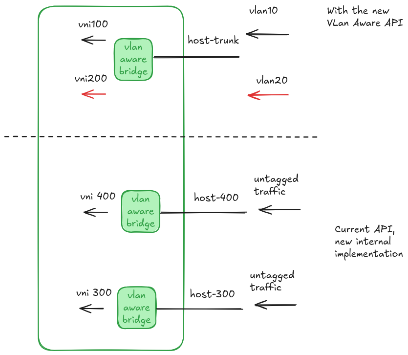
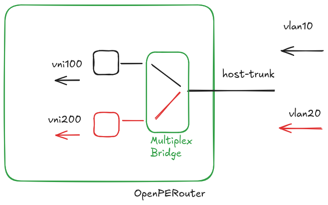

# L2VNI VLAN Trunks

## Summary and Motivation

Today, each L2VNI has its own host-facing veth pair, bridge, and VXLAN device:


This proposal adds an `L2Trunk` resource so VLAN-tagged L2VNIs can share one
host attachment, bridge, and VXLAN device:



In order to make the two implementations coexist, the current L2VNI
is reimplemented using the VLan aware model.

All L2VNIs and L3VNIs use the
[FRR VLAN filtering bridge and single VXLAN device model](https://docs.frrouting.org/en/latest/evpn.html#vlan-filtering-bridge-and-single-vxlan-device).
Existing resources keep their APIs and host-facing behavior; their VLANs
remain internal. Untagged trunk traffic, automatic migration to trunks, and
user configuration of internal VLANs are out of scope.

## Proposed API

`L2Trunk` owns the shared attachment, initially through an external Linux
bridge configured with `hostMaster`.

```yaml
apiVersion: network.openperouter.io/v1alpha1
kind: L2Trunk
metadata:
  name: workloads
spec:
  hostMaster:
    type: LinuxBridge
    linuxBridge:
      lifecycle: External
      name: br-workloads
```

Each L2VNI specifies its trunk and VLAN tag, retaining its own VNI, routing
domain, gateway, and route targets:

```yaml
apiVersion: network.openperouter.io/v1alpha1
kind: L2VNI
metadata:
  name: tenant-a
spec:
  vni: 10100
  trunk:
    name: workloads
    vlan:
      tag: 100
---
apiVersion: network.openperouter.io/v1alpha1
kind: L2VNI
metadata:
  name: tenant-b
spec:
  vni: 10200
  trunk:
    name: workloads
    vlan:
      tag: 200
```

`L2VNISpec.trunk` is optional. When set:

- `name` must resolve to an `L2Trunk`, and `vlan.tag` is required (1–4094).
  L2VNIs referencing a missing or deleted trunk are invalidated.
- The reference and tag are immutable; `hostMaster` is mutually exclusive.
- L2VNIs sharing a trunk must agree on effective `vxlanPort` and
  `underlayAddressFamily` settings.
- Tags must be unique per trunk per node; different trunks may reuse tags.

VNIs must be unique per node across trunks, standalone L2VNIs, and L3VNIs.
The controller reports conflicts without programming ambiguous mappings.

## Dataplane

### Trunk-attached L2VNIs

Creating an `L2Trunk` creates its veth pair, VLAN-aware bridge, and
`external vnifilter` VXLAN device, even without referencing L2VNIs.
The host veth attaches to `hostMaster`.
The controller configures tagged membership on the router-side veth and
VXLAN port, VLAN-to-VNI mappings, and VNI filters. No default PVID is set:
untagged frames and unconfigured tags are dropped.

The external host bridge's operator must restrict each workload port to its
assigned VLAN. Trunk filtering alone cannot stop workloads from sending
another configured tenant's tag.

Deleting an L2VNI removes its VLAN membership, mapping, VNI filter entry,
and gateway configuration. Shared devices are deleted only when the
`L2Trunk` is deleted, invalidating any L2VNIs that still reference it.

FRR retains per-L2VNI route targets; Zebra discovers mappings and routing
domains from Linux. Each VNI with `gatewayIPs` gets a macvlan gateway in its
routing domain, following FRR's
[anycast gateway guidance](https://docs.frrouting.org/en/latest/evpn.html#anycast-gateways-with-single-vxlan-device).
This supports repeated gateway IPs across VNIs. A local FDB entry for each
anycast MAC keeps gateway traffic off the overlay.

Each trunk supports up to 4094 VLAN-to-VNI mappings. Additional trunks can
extend capacity while preserving per-node VNI uniqueness.

### Standalone L2VNIs and L3VNIs

An L2VNI without `trunk` keeps its dedicated bridge, VXLAN device, and veth
pair. The host veth carries untagged traffic and attaches to `hostMaster`
when specified; otherwise it remains available for external attachment.
Internally, the router-side veth is an access port for one VLAN mapped to
its VNI on an `external vnifilter` VXLAN device.

Each L3VNI likewise keeps a dedicated bridge and VXLAN device, with one
internal VLAN. L3VNI, VRF, gateway, and routing APIs remain unchanged.
Internal VLAN IDs can be reused across dedicated bridges, requiring no
node-wide allocation or status field.

VXLAN devices with disjoint VNI filters can share the configured UDP port.
Coexistence and FRR's L2VNI-to-VRF discovery require validation on supported
kernels and FRR versions.

## Possible alternatives

### Shared host trunk selected by `hostMaster`

Keep `hostMaster` and `vlanTag` on each L2VNI. Matching external bridge
names identify one shared trunk; conflicting values are rejected. Its veth
remains until the last selected reference is removed. This avoids a new
resource but leaves attachment ownership shared between L2VNIs.

```yaml
apiVersion: network.openperouter.io/v1alpha1
kind: L2VNI
metadata:
  name: tenant-a
spec:
  vni: 10100
  vlanTag: 100
  hostMaster:
    type: LinuxBridge
    linuxBridge:
      lifecycle: External
      name: br-workloads
---
apiVersion: network.openperouter.io/v1alpha1
kind: L2VNI
metadata:
  name: tenant-b
spec:
  vni: 10200
  vlanTag: 200
  hostMaster:
    type: LinuxBridge
    linuxBridge:
      lifecycle: External
      name: br-workloads
```

### Dedicated `L2Trunk` with the reference under `vlan`

The PR's original `L2Trunk` alternative has the same ownership model as the
proposal, but places the trunk reference under `vlan`:

```yaml
apiVersion: network.openperouter.io/v1alpha1
kind: L2Trunk
metadata:
  name: workloads
spec:
  hostMaster:
    type: LinuxBridge
    linuxBridge:
      lifecycle: External
      name: br-workloads
```

```yaml
apiVersion: network.openperouter.io/v1alpha1
kind: L2VNI
metadata:
  name: tenant-a
spec:
  vni: 10100
  vlan:
    tag: 100
    trunk:
      name: workloads
---
apiVersion: network.openperouter.io/v1alpha1
kind: L2VNI
metadata:
  name: tenant-b
spec:
  vni: 10200
  vlan:
    tag: 200
    trunk:
      name: workloads
```

### `L2VNITrunk` with VLAN-to-VNI mappings

Put the attachment and mappings in one resource. Its controller creates and
owns an L2VNI per mapping; users update mappings through the trunk. The
mapping API must accommodate differing routing domains, route targets, and
gateway IPs. Adding a VNI requires editing the shared object.

```yaml
apiVersion: network.openperouter.io/v1alpha1
kind: L2VNITrunk
metadata:
  name: workloads
spec:
  hostMaster:
    type: LinuxBridge
    linuxBridge:
      lifecycle: External
      name: br-workloads
  mappings:
  - vni: 10100
    vlan:
      tag: 100
  - vni: 10200
    vlan:
      tag: 200
```

### Controller-assigned internal VLANs

Share a VLAN-aware bridge and VXLAN device across untagged L2VNIs too.
The controller allocates internal VLANs while host-facing access ports
remain untagged. Allocations must be persisted, stable, exclude configured
tags, and be reclaimed after deletion, within the bridge's 4094-VLAN limit.

Omitting `vlan` requests an internal allocation, recorded in status:

```yaml
apiVersion: network.openperouter.io/v1alpha1
kind: L2VNI
metadata:
  name: untagged-workload-network
spec:
  vni: 10300
```

Explicit `vlan.tag` reserves a user-selected tag instead. This reduces device
counts but requires allocation management.

### VLAN switching on the host bridge

Map each host VLAN to a dedicated access veth, retaining the traditional
router-side bridge and VXLAN device per VNI. The API can retain `vlanTag`
and `hostMaster` as in the shared-host-trunk example above.

The external bridge operator can configure VLAN membership and access ports,
or OpenPERouter can manage them on a managed bridge. OpenPERouter must avoid
modifying externally owned configuration and define cleanup of shared state.
This preserves existing L2/L3 wiring but still needs one veth pair per VNI.

### Hybrid variant using the current implementation

An internal switching bridge can connect a shared host trunk to the existing
per-VNI dataplane, using the trunk API above:



This retains per-VNI bridges and veths internally while sharing the host
attachment. Retaining traditional devices alongside VLAN-aware devices
would require a second dataplane configuration path.

## Implementation steps

1. Migrate existing L2VNIs and L3VNIs to VLAN-aware bridges and
   `external vnifilter` VXLAN devices, preserving their current APIs and
   host-facing behavior.
2. Add `L2Trunk` and `L2VNI.trunk` to support shared VLAN-tagged attachments
   using the same dataplane implementation.
   
## Validation and Testing

- API validation for references, exclusions, immutability, shared VXLAN
  settings, and tag/VNI uniqueness.
- Conversion and Linux/FRR configuration unit tests for all three cases.
- Connectivity for two trunk mappings, standalone L2VNIs with and without
  `hostMaster`, and a tagged L2VNI using an L3VNI/VRF.
- Rejection of untagged and unconfigured tags, deletion without disrupting
  other mappings, and recovery after restart or partial updates.
- Trunk creation without L2VNIs, retention after the last mapping is removed,
  and trunk deletion invalidating referencing L2VNIs.
- Shared UDP-port operation, FRR VRF discovery, and local anycast forwarding.
- Performance comparison against per-VNI host attachments.

## Compatibility

Existing manifests and host-facing behavior remain valid. Internal VLANs
require no user configuration. Static configuration supports the same
`L2Trunk` and `L2VNI.trunk` fields and semantics as the Kubernetes API.
