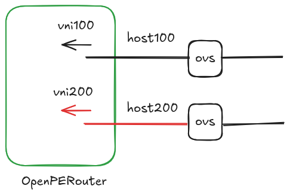
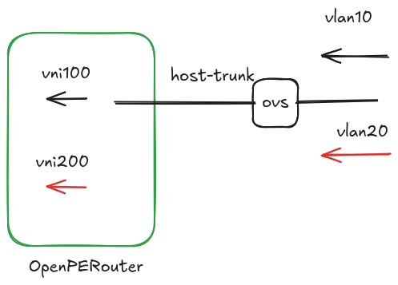

# L2VNI VLAN Tag

## Summary

This enhancement adds an optional `vlanTag` field to `L2VNI`. When set,
OpenPERouter configures the L2VNI using a VLAN-aware Linux bridge and a single
VXLAN device, following FRR's
[VLAN filtering bridge and single VXLAN device](https://docs.frrouting.org/en/latest/evpn.html#vlan-filtering-bridge-and-single-vxlan-device)
model.

## Motivation

OpenPERouter currently creates a traditional bridge and VXLAN device for each
L2VNI. Some EVPN deployments instead require an explicit VLAN-to-VNI mapping on
a VLAN-aware bridge. There is currently no way to express the local VLAN ID in
the L2VNI API. The per-VNI model also creates one bridge per VNI on the host,
which increases the number of network devices and configuration operations as
the number of L2VNIs grows.



OpenPERouter will expose one single trunk veth interface on the host side that
can be used to send vlan tagged traffic to the OpenPERouter's network namespace.

The vlan tags are mapped to VXLan's VNI:



### Goals

- Allow VLAN-tagged traffic on the host-facing network to be mapped to a given
  L2VNI's VNI, and traffic from that VNI to be mapped back to the VLAN.
- Allow an L2VNI to declare the local VLAN tag used for that mapping.
- Configure the Linux dataplane and FRR consistently with FRR's single VXLAN
  device model when the tag is present.
- Allow multiple workloads to share one `hostMaster`, with each workload
  isolated by the VLAN tag of its L2VNI.
- Improve scalability by sharing the host bridge and VXLAN device instead of
  creating one bridge and VXLAN device per tagged L2VNI.
- Preserve the existing behavior when the field is omitted.

### Non-Goals

- Replacing the existing untagged L2VNI dataplane.
- Exposing advanced bridge VLAN options such as per-port trunk configuration.
- Changing how VNIs, route targets, or routing domains are configured.
- Changing the L3VNI or VRF API and user-visible semantics.

## Proposal

Add the following optional field to `L2VNISpec`:

```go
type L2VNISpec struct {
	// vlanTag is the local IEEE 802.1Q VLAN identifier mapped to this L2VNI.
	// When set, the L2VNI uses the VLAN-aware bridge and single VXLAN device
	// dataplane.
	// +kubebuilder:validation:Minimum=1
	// +kubebuilder:validation:Maximum=4094
	// +optional
	VLANTag *int32 `json:"vlanTag,omitempty"`

	// ... existing fields
}
```

The VLAN tag must be unique among the L2VNIs selected for the same node. The
field is immutable because changing it requires replacing the dataplane
mapping.

Example:

```yaml
apiVersion: network.openperouter.io/v1alpha1
kind: L2VNI
metadata:
  name: tenant-a
spec:
  vni: 10100
  vlanTag: 100
```

### Dataplane behavior

When `vlanTag` is set, OpenPERouter configures the tagged L2VNI using the model
described by the FRR documentation:

- Create or reuse a shared bridge with VLAN filtering enabled and no default
  PVID.
- Create or reuse a shared VXLAN device with `external`, `vnifilter`, and
  `nolearning` enabled, and attach it to the bridge.
- Enable `vlan_tunnel`, neighbor suppression, and disabled learning on the
  VXLAN bridge port.
- Add the VLAN to the bridge and VXLAN port.
- Map `vlanTag` to `vni` and add the VNI to the VXLAN device's VNI filter.
- Associate the VLAN interface with the configured routing domain when the
  L2VNI uses integrated routing and bridging.
- For L2VNIs with `gatewayIPs`, create a macvlan interface for each VNI and
  gateway, following FRR's [anycast gateway guidance for a single VXLAN
  device](https://docs.frrouting.org/en/latest/evpn.html#anycast-gateways-with-single-vxlan-device).

The local gateway is still required when `gatewayIPs` is configured. In the
tagged model, OpenPERouter configures it on the macvlan interface for the VNI
and attaches that interface to the existing routing domain. This keeps gateway
interfaces for separate VNIs distinct even when they use the same gateway IP.
This proposal only changes the L2 VLAN-to-VNI dataplane; it does not change how
the referenced L3VNI or its VRF behaves from the user's perspective. Its
internal dataplane may also use the shared bridge, as discussed below.

Multiple tagged L2VNIs may use the same `hostMaster`. This allows workloads
belonging to different L2VNIs to share one host bridge while remaining isolated
by their distinct VLAN tags. Each L2VNI sharing that `hostMaster` must therefore
use a unique `vlanTag` on every node where their node selectors overlap.

A Linux bridge supports at most 4094 VLANs. The shared bridge can therefore
carry at most 4094 distinct VLAN-to-VNI mappings, including VLANs allocated
internally by OpenPERouter.

This shared model avoids creating a separate host bridge and VXLAN device for
every tagged L2VNI. The number of host network devices remains small as VNIs
are added, reducing kernel and reconciliation overhead in deployments with many
L2 segments.

FRR continues to receive the L2VNI route-target configuration generated by
OpenPERouter. The VLAN-aware bridge, VLAN-to-VNI mapping, and routing-domain
association allow FRR's zebra daemon to discover the L2VNI correctly through
Netlink.

### L2VNI without `vlanTag`

When the field is omitted from an L2VNI, OpenPERouter keeps the current
dataplane behavior. It creates a dedicated traditional bridge, VXLAN device,
and host-facing veth pair for that VNI. The existing
`hostMaster` semantics are unchanged: the L2VNI's host-side veth is attached
to its configured `hostMaster`, when present. Such L2VNIs do not use the shared
VLAN-aware bridge or shared trunk veth introduced by this enhancement.

## Items for Discussion

### Shared host veth and `hostMaster`

The VLAN-aware bridge needs only one veth pair toward the host. That veth acts
as a trunk carrying all VLANs mapped to tagged L2VNIs, rather than creating one
host-facing veth pair for every L2VNI.

Today, `hostMaster` belongs to each `L2VNI`, which does not clearly express
ownership of this shared veth. The implementation must define how the shared
host attachment is configured and validated. Options include:

- Keep `hostMaster` on `L2VNI` and require every tagged L2VNI sharing the
  dataplane to specify an identical value.
- Use `hostMaster` from only one L2VNI and require it to be omitted from the
  others, introducing an explicit owner for the shared host leg.
- Move the shared host attachment to a node-level or dedicated configuration,
  leaving `L2VNI.hostMaster` only for the existing per-VNI dataplane.

The chosen model must also define lifecycle ownership, reject conflicting
`hostMaster` values, and ensure that deleting one L2VNI does not remove the
shared veth while other tagged L2VNIs still use it.

### Untagged traffic on the VLAN-aware host leg

Untagged traffic is not supported on the shared VLAN-aware veth. OpenPERouter
configures no default PVID, so a frame arriving without a VLAN tag is not
mapped to any VLAN or VNI and is dropped. This enhancement does not expose a
native-VLAN option.

### Mixing the L2 and L3 dataplane models

The baseline design uses a VLAN-aware single bridge and single VXLAN device for
tagged L2VNIs while leaving L3VNIs and VRFs on their current per-VNI bridge and
VXLAN device implementation. In this mixed model, the shared L2 VXLAN device
and the existing L3VNI VXLAN devices must use different UDP destination ports.
Using distinct ports lets Linux direct VXLAN traffic to the correct dataplane;
see the [EVPN lab explanation](https://github.com/fedepaol/evpnlab/tree/main/11_clab_l2_l3_single_bridge#why-two-vxlan-udp-ports).

The implementation must verify that FRR correctly discovers the L2VNI-to-VRF
association when the L2 SVI is on the shared VLAN-aware bridge but the L3VNI
uses a separate traditional bridge. It must also verify that the shared
`external` VXLAN device can coexist with the traditional L3VNI VXLAN devices
when their UDP ports differ.
If the mixed model is not supported reliably, adopting the single-device model
may also require changing the L3VNI dataplane. Moving L3VNIs to the same shared
VLAN-aware bridge and single VXLAN device is a valid implementation option:
the VLAN used for an L3VNI is internal to the node, so the change should not
affect the L3VNI API or require action from users. The existing VRF, routing,
and gateway semantics must remain unchanged. Whether to include this internal
L3VNI migration in the initial implementation depends on the results of the
mixed-model validation.

## Alternatives

### Shared host trunk selected by `hostMaster`

This alternative keeps `hostMaster` on each `L2VNI`. Tagged L2VNIs selected
for the same node must specify the same `hostMaster`; the controller rejects a
configuration with different values. The matching `hostMaster` identifies one
shared trunk, so OpenPERouter creates and exposes one host-side veth for all of
those L2VNIs.

The shared `hostMaster` must be an external bridge with a stable name. A
managed bridge cannot identify the shared trunk because its generated name
contains the individual VNI.

#### Possible API

Two L2VNIs can use the same host bridge and therefore the same trunk veth by
repeating the existing `hostMaster` configuration:

```yaml
apiVersion: network.openperouter.io/v1alpha1
kind: L2VNI
metadata:
  name: tenant-a
spec:
  vni: 10100
  vlanTag: 100
  hostMaster:
    type: LinuxBridge
    linuxBridge:
      lifecycle: External
      name: br-workloads
---
apiVersion: network.openperouter.io/v1alpha1
kind: L2VNI
metadata:
  name: tenant-b
spec:
  vni: 10200
  vlanTag: 200
  hostMaster:
    type: LinuxBridge
    linuxBridge:
      lifecycle: External
      name: br-workloads
```

Here, `br-workloads` receives a single veth from OpenPERouter that carries VLANs
100 and 200. The controller must retain the veth until no tagged L2VNI selected
for the node refers to that `hostMaster`.

### Dedicated `L2Trunk` resource

This alternative introduces an `L2Trunk` resource that owns the shared host
attachment. An L2VNI references the trunk together with its VLAN tag. The
controller creates one host-side veth per `L2Trunk`, and all L2VNIs that refer
to it use that veth as their tagged host leg.

When an L2VNI references a trunk, `hostMaster` is rejected. The host attachment
is configured only on the `L2Trunk`, avoiding conflicting ownership between the
two resources.

#### Possible API

The trunk declares the host bridge once:

```yaml
apiVersion: network.openperouter.io/v1alpha1
kind: L2Trunk
metadata:
  name: workloads
spec:
  hostMaster:
    type: LinuxBridge
    linuxBridge:
      lifecycle: External
      name: br-workloads
```

Each L2VNI selects the trunk and provides its VLAN-to-VNI mapping:

```yaml
apiVersion: network.openperouter.io/v1alpha1
kind: L2VNI
metadata:
  name: tenant-a
spec:
  vni: 10100
  vlan:
    tag: 100
    trunk:
      name: workloads
---
apiVersion: network.openperouter.io/v1alpha1
kind: L2VNI
metadata:
  name: tenant-b
spec:
  vni: 10200
  vlan:
    tag: 200
    trunk:
      name: workloads
```

`L2Trunk` lifecycle follows its references: its veth remains while at least one
selected L2VNI references it, and is removed after the final reference is gone.

### `L2VNITrunk` with VLAN-to-VNI mappings

This alternative combines the host attachment and the VLAN-to-VNI mappings in a
single `L2VNITrunk` resource. It can contain multiple mappings, so an operator
adds or removes a mapping by updating one trunk resource rather than creating or
changing individual L2VNIs.

The `L2VNITrunk` controller reconciles the shared host attachment and creates
one managed L2VNI for each mapping. Each generated L2VNI is owned by the trunk
resource and carries the mapping's VNI and VLAN tag. The generated L2VNIs do not
set `hostMaster`; the trunk controller owns that part of the configuration.

#### Possible API

```yaml
apiVersion: network.openperouter.io/v1alpha1
kind: L2VNITrunk
metadata:
  name: workloads
spec:
  hostMaster:
    type: LinuxBridge
    linuxBridge:
      lifecycle: External
      name: br-workloads
  mappings:
  - vni: 10100
    vlan:
      tag: 100
  - vni: 10200
    vlan:
      tag: 200
```

The controller generates one L2VNI for each mapping. For example, the first
mapping generates an L2VNI with VNI 10100 and VLAN tag 100. The generated
L2VNIs are controller-managed, so users update their mappings on `L2VNITrunk`.
The mapping format must also accommodate any L2VNI-specific settings that need
to differ between mappings, such as routing domains, route targets, or gateway
IPs.

### Controller-assigned internal VLANs

OpenPERouter could use the VLAN-aware shared bridge and VXLAN device for every
L2VNI, including L2VNIs that do not expose VLAN-tagged traffic to workloads.
For an L2VNI without an explicitly configured VLAN tag, the controller assigns
an internal VLAN ID from an OpenPERouter-managed pool. The assigned VLAN is used
only inside the OpenPERouter dataplane, while the workload-facing port remains
an access port and continues to carry untagged traffic.

This gives OpenPERouter one internal dataplane implementation: every L2VNI has
a VLAN-to-VNI mapping on the shared bridge and VXLAN device. Explicit VLAN tags
remain available for trunk-attached workloads; automatically assigned tags serve
L2VNIs whose workloads are not VLAN-aware.

The controller must persist each allocation, reserve it from the pool, and keep
it stable for the lifetime of the L2VNI. The pool must exclude explicitly
configured VLAN tags and other internal VLANs on the node, reclaim a tag only
after its L2VNI is deleted, and never allocate more than the bridge limit of
4094 VLANs.

#### Possible API

No extra L2VNI field is required for an automatically assigned VLAN. Omitting
`vlan` requests an internal allocation:

```yaml
apiVersion: network.openperouter.io/v1alpha1
kind: L2VNI
metadata:
  name: untagged-workload-network
spec:
  vni: 10300
```

The controller records the allocated VLAN ID in status so that users and
operators can inspect the effective mapping. A user that needs a workload-facing
trunk supplies `vlan.tag` instead, which reserves that specified VLAN rather
than allocating one.

### VLAN Switching on the Host Bridge

Instead of making the router-side bridge and VXLAN device VLAN-aware, VLAN
switching could happen on the host bridge referenced by `hostMaster`. The host
bridge would receive the tagged workload traffic and map each VLAN to a
dedicated OpenPERouter veth leg configured as an access port. OpenPERouter
could then keep the existing traditional bridge and VXLAN device per L2VNI on
the router side.

The host bridge VLAN configuration could be managed in either of two ways:

- **Externally managed:** another controller or the operator configures VLAN
  filtering, the workload trunk, and each OpenPERouter veth as an access port.
  OpenPERouter only attaches its host-side veth to the bridge and documents the
  required VLAN configuration.
- **Managed by OpenPERouter:** OpenPERouter enables VLAN filtering on a managed
  `hostMaster` and programs the VLAN membership, PVID, and untagged behavior of
  each veth from `L2VNI.vlanTag`.

This alternative avoids mixing a single-device L2 dataplane with the existing
multi-bridge L3VNI dataplane and retains the current L2VNI-to-VRF wiring.
However, it still requires one veth pair, router-side bridge, and VXLAN device
per L2VNI, so it does not provide the same network-device scalability benefit
as the shared bridge and single VXLAN device model. The OpenPERouter-managed
variant must also avoid modifying externally owned bridges and ports, and must
define how shared bridge configuration is reconciled and cleaned up.

## Validation and Testing

Implementation should cover:

- API validation for the VLAN range, immutability, and per-node uniqueness.
- Unit tests for conversion and Linux/FRR configuration generation.
- An end-to-end test that verifies EVPN connectivity for a tagged L2VNI.

## Compatibility

The change is additive. Existing L2VNI resources do not set `vlanTag` and keep
their current behavior. Static configuration uses the same field and
semantics as the Kubernetes API.
