# Control & Data Plane Resiliency for OpenPERouter

## Summary

OpenPERouter currently ties its data plane lifecycle to the FRR container
lifecycle. When the router pod dies, Kubernetes destroys its network namespace,
tearing down all VXLAN tunnels, VRFs, bridges, veth endpoints, the underlay
NIC, and the VTEP loopback. The kernel could keep forwarding packets with its
existing FDB and routing entries, but the ephemeral netns wipes everything.

This enhancement proposes decoupling the data plane from the FRR container by
running the router inside a **persistent named network namespace**. The netns
is held open by a bind mount, independent of any container or process lifetime.
Traffic continues flowing when the router container crashes or restarts, and
the control plane recovers within seconds via BGP Graceful Restart.

## Motivation

### Goals

- **Zero data plane disruption** on FRR process crash or restart: the kernel
  continues forwarding packets using existing routes and FDB entries while FRR
  recovers.
- **Fast control plane recovery** (~7-22 seconds): FRR re-enters the existing
  network namespace, finds all interfaces intact, and re-establishes BGP
  sessions using Graceful Restart.
- **Simplified controller logic**: the controller targets a well-known netns
  path (`/var/run/netns/perouter`) instead of discovering a pod's netns via CRI
  queries or PID file parsing.
- **Decoupled interface provisioning**: the controller can pre-configure
  interfaces before FRR starts, rather than waiting for pod readiness.
- **Preserve the Multus underlay option**: the current deployment model supports
  underlay connectivity via either moving a physical NIC or via Multus
  `NetworkAttachmentDefinition`. The preferred proposal retains compatibility
  with both approaches (see [Multus Integration](#multus-integration)).

### Non-Goals

- Protection against full node (kernel) failure. Per-node resilience only
  addresses FRR process-level failures; node-level failures are handled at the
  fabric/cluster layer.
- Hitless upgrades in a single-instance deployment. Rolling upgrades without
  traffic loss require redundant instances (see
  [Alternatives](#alternatives)).
- Changes to workload pod networking. Multus-attached secondary interfaces on
  application pods and KubeVirt VMs are unaffected by this proposal.

## Proposal

### Overview

Replace the ephemeral pod-owned network namespace with a **persistent named
network namespace** (`/var/run/netns/perouter`) created at boot and held open
by a bind mount. The FRR process runs inside this namespace; when FRR dies, the
bind-mounted namespace persists, keeping all kernel networking state alive —
VRFs, bridges, VXLANs, routes, FDB entries, and the underlay NIC all survive.

### Router pod deployment model
The persistent named netns is the **core idea** of this proposal. It is
orthogonal to how the FRR container is deployed, which can be in any of the
following alternatives:

- **Podman quadlet**: a systemd oneshot creates the netns; the FRR container
  joins it via `Network=ns:/var/run/netns/perouter`. Systemd manages the
  lifecycle.
- **Kubernetes hostNetwork pod**: a privileged init container (or a DaemonSet
  sidecar) creates the named netns; the FRR container uses `nsenter` to run
  inside it. The pod runs with `hostNetwork: true` but FRR itself operates in
  the named netns.
- **Kubernetes pod with CRI netns binding**: the pod's own netns is bind-mounted
  to a well-known path at creation time, decoupling the netns lifetime from the
  pod lifetime.

The deployment model affects how the container is managed and restarted, but
the resilience properties — persistent data plane, BGP Graceful Restart
bridging the control plane gap — are the same in all cases. The trade-offs
between these options are discussed in
[Router Deployment Model](#router-deployment-model).

### Architecture

```
┌─────────────────────────────────────────────────────────────────┐
│                        K8s Node (Host)                          │
│                                                                 │
│  ┌──────────────────────────────────────┐                       │
│  │  Named Netns: /var/run/netns/perouter│  ◄── persists across  │
│  │  (created by systemd oneshot at boot)│      container death  │
│  │                                      │                       │
│  │  ┌─────────┐  ┌──────────┐           │                       │
│  │  │ lound   │  │ eth1     │           │                       │
│  │  │ (VTEP)  │  │(underlay)│           │                       │
│  │  └─────────┘  └──────────┘           │                       │
│  │                                      │                       │
│  │  ┌─────────────────────────────┐     │                       │
│  │  │ vrf100                      │     │                       │
│  │  │  ├─ br100 ─── vxlan100      │     │                       │
│  │  │  └─ pe0 (veth) ─────────────┼──┐  │                       │
│  │  └─────────────────────────────┘  │  │                       │
│  │                                   │  │                       │
│  │  FRR processes (come and go)      │  │                       │
│  │   bgpd, zebra, bfdd, staticd      │  │                       │
│  └───────────────────────────────────┼──┘                       │
│                                      │                          │
│  Host Network Namespace              │                          │
│  ┌───────────────────────────────────┼─────────────────┐        │
│  │  host0 (veth) ◄───────────────────┘                 │        │
│  │    ↕ BGP session (frr-k8s / Calico / Cilium)        │        │
│  │                                                     │        │
│  │  br-hs-{vni} (host bridges for L2VNI)               │        │
│  │  eth0 / CNI interfaces (K8s pod networking)         │        │
│  └─────────────────────────────────────────────────────┘        │
│                                                                 │
│  Systemd Units:                                                 │
│  ├─ perouter-netns.service  (oneshot, creates named netns)      │
│  ├─ routerpod-pod.service   (FRR + reloader, joins named netns) │
│  └─ controllerpod-pod.service (or K8s DaemonSet)                │
│                                                                 │
│  K8s Workload Pods (unchanged):                                 │
│  ├─ Pod A ── eth0 (CNI) + net1 (Multus macvlan → br-hs-100)     │
│  └─ Pod B ── eth0 (CNI) + net1 (Multus macvlan → br-hs-200)     │
└─────────────────────────────────────────────────────────────────┘
```

### User Stories

#### Story 1: FRR Process Crash

As a cluster operator, I want traffic to continue flowing when the FRR process
crashes, so that workloads experience zero data plane disruption while the
control plane recovers automatically within seconds.

#### Story 2: Router Software Upgrade

As a cluster operator, I want to restart the FRR container for a version
upgrade without tearing down VXLAN tunnels or VRFs, so that existing traffic
flows are not interrupted during the upgrade.

#### Story 3: Simplified Debugging

As a developer, I want the router's network namespace to be a well-known path
(`/var/run/netns/perouter`) so I can inspect it with standard tools
(`ip netns exec perouter ...`) without needing to discover a pod PID or netns
inode.

#### Story 4: Recovery from Out-of-Sync Namespace

As a support engineer troubleshooting a node where the router namespace has
drifted out of sync with the desired configuration (e.g. due to a controller
bug, a partial failure, or manual intervention), I want a single, well-known
recovery procedure — delete the namespace and restart the router service — that
deterministically rebuilds the entire data plane from scratch without requiring
node reboot or CRD re-creation.

### Risks and Mitigations

| Risk | Mitigation |
|------|------------|
| Named netns is not cleaned up on node shutdown | `perouter-netns.service` has `ExecStop=ip netns delete perouter`; netns is also cleaned on reboot since `/var/run` is a tmpfs |
| FRR restarts too quickly before interfaces are ready | Interfaces persist in the named netns; FRR always finds them ready |
| BGP Graceful Restart not supported by all peers | GR is widely supported (FRR, BIRD, Cisco, Arista); document peer requirements |
| `lound` dummy interface never set to UP state (existing bug) | Fix `createLoopback()` in `internal/hostnetwork/underlay.go` to call `netlink.LinkSetUp(lound)` |
| Router netns drifts out of sync with desired config (controller bug, partial failure, manual interference) | The system is designed for full netns teardown and rebuild: `ip netns delete perouter` + `systemctl restart perouter-netns.service routerpod-pod.service` deterministically recreates a correct state. The controller detects the empty netns and re-provisions all interfaces from CRD state. See [Recovery from a Deleted or Emptied Namespace](#recovery-from-a-deleted-or-emptied-namespace). |

## Design Details

### Named Netns Lifecycle

A systemd oneshot unit creates the namespace at boot:

```ini
# perouter-netns.service
[Unit]
Description=Create persistent PE router network namespace
Before=routerpod-pod.service

[Service]
Type=oneshot
RemainAfterExit=yes
ExecStart=/usr/sbin/ip netns add perouter
ExecStop=/usr/sbin/ip netns delete perouter

[Install]
WantedBy=multi-user.target
```

This creates `/var/run/netns/perouter` — a bind mount that holds the netns open
independently of any process. It persists until explicitly deleted or the node
reboots.

### FRR Quadlet Configuration

The key change in `frr.container`:

```ini
[Container]
# Join the persistent named netns instead of getting an ephemeral one:
Network=ns:/var/run/netns/perouter
```

When the container starts, Podman runs it inside `/var/run/netns/perouter`.
When the container dies, the netns stays. When systemd restarts the container,
it re-enters the same netns with all interfaces intact.

### Controller Netns Discovery

The `RouterProvider` interface
(`internal/controller/routerconfiguration/router.go`) already abstracts netns
discovery. A new `RouterNamedNSProvider` returns the well-known path:

```go
type RouterNamedNSProvider struct {
    NamespacePath string // "/run/netns/perouter"
}

func (r *RouterNamedNSProvider) TargetNS(ctx context.Context) (string, error) {
    return r.manager.NamespacePath, nil
}

func (r *RouterNamedNSProvider) HandleNonRecoverableError(ctx context.Context) error {
	client, err := systemdctl.NewClient()
	if err != nil {
		return fmt.Errorf("failed to create systemd client %w", err)
	}
	slog.Info("restarting router systemd unit", "unit", "routerpod-pod.service")
	if err := client.Restart(ctx, "routerpod-pod.service"); err != nil {
		return fmt.Errorf("failed to restart routerpod service")
	}
	slog.Info("router systemd unit restarted", "unit", "routerpod-pod.service")

	return nil
}

func (r *RouterNamedNSProvider) CanReconcile(ctx context.Context) (bool, error) {
    ns, err := netns.GetFromPath(r.manager.NamespacePath)
    if err != nil {
        return false, nil  // netns not ready yet
    }
    defer ns.Close()
    return true, nil
}
```

### Decoupled Lifecycle Sequence

With a named netns, the controller can pre-configure interfaces before FRR
starts:

1. **Boot** - `perouter-netns.service` creates the netns
2. **Controller starts** - immediately configures interfaces in the netns
   (VRFs, bridges, VXLANs, veths, underlay NIC)
3. **FRR starts later** - enters the netns, finds everything already set up,
   starts routing

The following sequence diagrams illustrate how systemd, the controller, FRR,
and the BGP peers interact across the three key lifecycle scenarios.

#### Initial Boot Sequence

```mermaid
sequenceDiagram
    autonumber
    participant systemd
    participant netns as Named Netns<br/>/var/run/netns/perouter
    participant ctrl as Controller<br/>(DaemonSet or Quadlet)
    participant k8s as K8s API
    participant reloader as Reloader<br/>(routerpod pod)
    participant frr as FRR<br/>(routerpod pod)
    participant tor as ToR Switch<br/>(BGP Peer)
    participant hostBGP as Host BGP Speaker<br/>(frr-k8s / Calico)

    Note over systemd: Node boots

    rect rgb(20, 40, 70)
        Note right of systemd: Phase 1: Named Netns Creation
        systemd->>netns: ip netns add perouter<br/>(perouter-netns.service, oneshot)
        activate netns
        Note over netns: Bind mount created at<br/>/var/run/netns/perouter<br/>Persists independently of any process
    end

    rect rgb(20, 55, 35)
        Note right of systemd: Phase 2: Controller Starts
        systemd->>ctrl: Start controllerpod-pod.service<br/>(or K8s schedules DaemonSet pod)
        activate ctrl
        ctrl->>k8s: List Underlay, L3VNI, L2VNI,<br/>L3Passthrough CRDs
        k8s-->>ctrl: CRD specs (filtered by node selector)

        ctrl->>netns: RouterNamedNSProvider.CanReconcile()<br/>Check /var/run/netns/perouter exists
        netns-->>ctrl: Netns exists, ready to configure

        Note over ctrl,netns: Pre-configure interfaces before FRR starts

        ctrl->>netns: SetupUnderlay()<br/>Move physical NIC (eth1) into netns
        ctrl->>netns: Create lound dummy interface<br/>Assign VTEP IP (e.g. 100.65.0.X/32)
        ctrl->>netns: SetupL3VNI() for each L3VNI:<br/>Create VRF, bridge, VXLAN,<br/>veth pair (pe-side in netns, host-side in host)
        ctrl->>netns: SetupL2VNI() for each L2VNI:<br/>Create VRF, bridge, VXLAN,<br/>veth pair, host-side bridge (br-hs-{vni})
        ctrl->>netns: SetupPassthrough() if configured:<br/>Create veth pair for host BGP connectivity

        Note over ctrl: All interfaces ready in netns<br/>before FRR starts
    end

    rect rgb(70, 45, 15)
        Note right of systemd: Phase 3: FRR Container Starts
        systemd->>frr: Start routerpod-pod.service<br/>Network=ns:/var/run/netns/perouter
        activate frr
        Note over frr: Podman joins named netns<br/>FRR finds all interfaces already configured

        systemd->>reloader: Start reloader container<br/>(same pod, same netns)
        activate reloader
        reloader-->>reloader: Listen on Unix socket<br/>/etc/perouter/frr.socket<br/>Health endpoint :9080/healthz
    end

    rect rgb(55, 25, 60)
        Note right of systemd: Phase 4: FRR Configuration & BGP Sessions
        ctrl->>ctrl: APItoFRR(): generate FRR config<br/>from CRD specs + nodeIndex
        ctrl->>reloader: POST config via Unix socket<br/>/etc/perouter/frr.socket
        reloader->>reloader: frr-reload.py --test (validate)
        reloader->>frr: frr-reload.py --reload (apply)
        reloader-->>ctrl: HTTP 200 OK

        frr->>frr: zebra discovers existing interfaces<br/>(VRFs, bridges, VXLANs, veths, lound)
        frr->>tor: BGP OPEN (underlay session)<br/>ASN 64514, capabilities: EVPN, GR
        tor-->>frr: BGP OPEN (accept)
        frr->>tor: EVPN Type-5 routes (L3VNI prefixes)<br/>EVPN Type-2 routes (MAC/IP for L2VNI)
        tor-->>frr: EVPN routes from fabric

        frr->>hostBGP: BGP OPEN (host session via veth)<br/>Per-L3VNI and/or passthrough sessions
        hostBGP-->>frr: BGP OPEN (accept)
        hostBGP->>frr: Host routes (CNI, services, VIPs)
        frr->>hostBGP: VNI routes from EVPN fabric
    end

    Note over netns,frr: System fully operational<br/>Data plane forwarding, control plane converged
```



#### FRR Container Crash & Recovery

```mermaid
sequenceDiagram
    autonumber
    participant kernel as Kernel<br/>(Data Plane)
    participant netns as Named Netns<br/>/var/run/netns/perouter
    participant systemd
    participant ctrl as Controller
    participant reloader as Reloader
    participant frr as FRR
    participant tor as ToR Switch
    participant hostBGP as Host BGP Speaker

    Note over kernel,hostBGP: System running normally — traffic flowing

    rect rgb(70, 25, 25)
        Note right of frr: FRR Process Dies
        frr->>frr: CRASH (segfault / OOM / kill)
        Note over reloader,frr: routerpod-pod.service exits<br/>Both FRR and reloader are gone

        Note over tor: BGP session drops<br/>(TCP RST or hold timer expiry)
        Note over hostBGP: BGP session drops

        tor->>tor: BGP Graceful Restart activated<br/>Preserve stale routes for restart-time (120s)<br/>Mark routes as stale, keep forwarding
        hostBGP->>hostBGP: BGP Graceful Restart activated<br/>Preserve stale routes, keep forwarding
    end

    rect rgb(20, 55, 35)
        Note right of kernel: Data Plane Continues (zero disruption)
        Note over netns: Named netns persists!<br/>Held by bind mount, not by FRR process
        Note over kernel,netns: All kernel state intact in netns:
        Note over kernel: VRFs, bridges, VXLAN interfaces<br/>Veth pairs (pe ↔ host)<br/>Underlay NIC (eth1), lound (VTEP)<br/>Kernel routing tables (installed by zebra)<br/>Bridge FDB entries<br/>ARP/neighbor entries<br/>IP addresses on all interfaces

        kernel->>kernel: Continue forwarding packets<br/>using existing routes and FDB<br/>VXLAN encap/decap still works<br/>Inter-VRF routing still works
    end

    rect rgb(70, 45, 15)
        Note right of systemd: Systemd Fast Restart (~1-2s)
        systemd->>systemd: Detect unit failure<br/>RestartSec=1
        systemd->>frr: Restart routerpod-pod.service<br/>Network=ns:/var/run/netns/perouter
        activate frr
        systemd->>reloader: Restart reloader (same pod)
        activate reloader
        Note over frr: FRR re-enters the SAME named netns<br/>All interfaces already present and UP
    end

    rect rgb(20, 40, 70)
        Note right of frr: FRR Recovery (~2-5s)
        frr->>frr: Read /etc/frr/frr.conf<br/>Start zebra, bgpd, bfdd, staticd
        frr->>frr: zebra discovers existing interfaces<br/>VRFs, bridges, VXLANs all found intact
        frr->>frr: preserve-fw-state: do NOT flush<br/>existing kernel routes
        reloader-->>reloader: Health endpoint :9080 ready
    end

    rect rgb(55, 25, 60)
        Note right of frr: BGP Session Re-establishment (~3-10s)
        frr->>tor: BGP OPEN with GR capability<br/>Indicates restart, requests route preservation
        tor-->>frr: BGP OPEN (accept restart)
        tor->>tor: Clear stale flag on preserved routes
        frr->>tor: Re-advertise EVPN routes<br/>(same routes as before crash)
        tor-->>frr: Send current fabric routes

        frr->>hostBGP: BGP OPEN with GR capability
        hostBGP-->>frr: BGP OPEN (accept restart)
        hostBGP->>hostBGP: Clear stale flag on preserved routes
        frr->>hostBGP: Re-advertise VNI routes
        hostBGP->>frr: Re-send host routes
    end

    rect rgb(40, 45, 50)
        Note right of ctrl: Controller Observes Recovery
        ctrl->>ctrl: CanReconcile() returns true<br/>(systemd unit active + health check passes)
        ctrl->>ctrl: Normal reconciliation resumes<br/>No interface re-creation needed<br/>(everything survived in netns)
    end

    Note over kernel,hostBGP: Full recovery complete<br/>Data plane: 0s outage<br/>Control plane: ~7-22s outage (bridged by GR)
```



#### Reconfiguration (New L2VNI CRD Created)

```mermaid
sequenceDiagram
    autonumber
    participant user as Operator
    participant k8s as K8s API
    participant ctrl as Controller
    participant netns as Named Netns<br/>/var/run/netns/perouter
    participant hostNS as Host Netns
    participant reloader as Reloader
    participant frr as FRR<br/>(zebra / bgpd)
    participant tor as ToR Switch

    Note over user,tor: System running with existing L3VNI config

    rect rgb(20, 40, 70)
        Note right of user: CRD Creation
        user->>k8s: kubectl apply -f l2vni-100.yaml<br/>VNI: 100, VRF: l2vni-100<br/>L2 Gateway: 10.100.0.1/24<br/>Host bridge: br-hs-100 (linux-bridge)
    end

    rect rgb(70, 45, 15)
        Note right of ctrl: Watch Event & Reconciliation Trigger
        k8s-->>ctrl: L2VNI watch event (CREATE)
        ctrl->>k8s: List all CRDs:<br/>Underlays, L3VNIs, L2VNIs, L3Passthroughs
        k8s-->>ctrl: Full config (includes new L2VNI-100)
        ctrl->>ctrl: Filter CRDs by node selector<br/>Merge with static config (if any)
        ctrl->>ctrl: Validate all resources<br/>(VNI uniqueness, IP formats, VRF names)
    end

    rect rgb(20, 55, 35)
        Note right of ctrl: Readiness Check
        ctrl->>ctrl: RouterNamedNSProvider.CanReconcile()<br/>Check /var/run/netns/perouter exists
        ctrl->>reloader: Health check :9080/healthz
        reloader-->>ctrl: 200 OK (FRR is running and healthy)
    end

    rect rgb(55, 25, 60)
        Note right of ctrl: Interface Configuration in Router Netns
        ctrl->>netns: setupVNI(VNI=100):<br/>1. netlink.LinkAdd(VRF "l2vni-100")<br/>2. netlink.LinkAdd(Bridge "br-pe-100")<br/>3. netlink.LinkAdd(VXLAN "vxlan-100"<br/>   VNI=100, VTEP=lound IP)<br/>4. Enslave vxlan-100 → br-pe-100<br/>5. Link set all UP

        ctrl->>ctrl: setupNamespacedVeth():<br/>Create veth pair<br/>vni-100-ns ↔ vni-100-host

        ctrl->>netns: Move vni-100-ns into router netns<br/>Assign IP to vni-100-ns<br/>Enslave vni-100-ns → br-pe-100<br/>Assign L2 gateway IP 10.100.0.1/24<br/>to br-pe-100

        ctrl->>hostNS: Keep vni-100-host in host netns<br/>Assign IP to vni-100-host<br/>Create host bridge br-hs-100<br/>(if autoCreate=true)<br/>Enslave vni-100-host → br-hs-100

        ctrl->>ctrl: Start BridgeRefresher(L2VNI-100)<br/>Periodic ARP probes every 60s<br/>from 10.100.0.1 on br-pe-100<br/>to refresh EVPN Type-2 routes
    end

    rect rgb(55, 50, 20)
        Note right of ctrl: FRR Configuration Update
        ctrl->>ctrl: APItoFRR(): regenerate full FRR config<br/>(underlay + all L3VNIs + passthrough)
        Note over ctrl: L2VNIs are data-plane only,<br/>no FRR BGP config needed for L2.<br/>EVPN auto-discovers VXLANs via zebra.

        ctrl->>reloader: POST updated config via Unix socket<br/>/etc/perouter/frr.socket
        reloader->>reloader: Write /etc/perouter/frr.conf
        reloader->>reloader: frr-reload.py --test (validate)
        reloader->>frr: frr-reload.py --reload (apply delta)
        reloader-->>ctrl: HTTP 200 OK
    end

    rect rgb(20, 40, 70)
        Note right of frr: FRR Discovers New VXLAN
        frr->>frr: zebra detects new vxlan-100 interface<br/>in VRF l2vni-100
        frr->>frr: EVPN auto-associates VNI 100<br/>with the VXLAN interface
        frr->>tor: EVPN Type-3 (IMET): advertise<br/>BUM replication for VNI 100
        frr->>tor: EVPN Type-2: advertise local<br/>MAC/IP entries from br-pe-100 FDB
        tor-->>frr: EVPN Type-2/3 from remote VTEPs<br/>for VNI 100
        frr->>frr: zebra installs remote FDB entries<br/>into br-pe-100 (VXLAN tunnel MACs)
    end

    rect rgb(40, 45, 50)
        Note right of ctrl: Cleanup
        ctrl->>ctrl: RemoveNonConfigured():<br/>Compare existing VNIs vs desired config<br/>Remove VNIs no longer in any CRD<br/>Stop their BridgeRefreshers
    end

    Note over hostNS: Workload pods can now attach to br-hs-100<br/>via Multus NetworkAttachmentDefinition<br/>(macvlan/bridge on br-hs-100)

    Note over user,tor: L2VNI-100 fully operational<br/>Workload ↔ br-hs-100 ↔ veth ↔ br-pe-100 ↔ vxlan-100 ↔ fabric
```



### What Survives an FRR Container Death

When FRR dies, the kernel state in the named netns is completely preserved:

| Component | Survives? | Why |
|-----------|-----------|-----|
| VRFs | Yes | Kernel objects, not tied to any process |
| Bridges | Yes | Kernel objects |
| VXLAN interfaces | Yes | Kernel objects |
| Veth pairs (pe/host) | Yes | Kernel objects |
| Underlay physical NIC | Yes | Stays in the netns |
| `lound` (VTEP loopback) | Yes | Kernel dummy interface |
| Kernel routing tables | Yes | Installed by zebra, persist after zebra dies |
| Bridge FDB entries | Yes | Kernel bridge state |
| ARP/neighbor entries | Yes | Kernel neighbor table |
| IP addresses on interfaces | Yes | Kernel address state |

The only thing lost is the BGP control plane — sessions drop. With **BGP
Graceful Restart**, peers preserve routes for a configurable window, giving FRR
time to restart and re-establish sessions without data plane disruption.

### FRR Restart Sequence

1. FRR process dies
2. Named netns persists (held by the bind mount, not by any process)
3. All interfaces, routes, FDB entries remain intact
4. **Data plane keeps forwarding** using existing kernel state
5. Systemd restarts the FRR container (~1-2s)
6. Container re-enters the named netns via `Network=ns:/var/run/netns/perouter`
7. FRR starts, reads config, zebra discovers existing interfaces (~2-5s)
8. FRR re-establishes BGP sessions (~3-10s)
9. With BGP Graceful Restart, peers preserved routes during the downtime

### BGP Graceful Restart Configuration

```
router bgp 64514
  bgp graceful-restart
  bgp graceful-restart preserve-fw-state
  bgp graceful-restart stalepath-time 30
  bgp graceful-restart restart-time 120
```

Peers preserve routes for up to 120s (restart-time) while FRR recovers.
`preserve-fw-state` tells FRR not to flush kernel routes on restart.

### Systemd Fast Restart

```ini
[Service]
Restart=always
RestartSec=1
WatchdogSec=10
```

Systemd restarts FRR within 1 second of failure. With a named netns, FRR
re-enters the existing netns, discovers existing interfaces, and begins
re-establishing BGP sessions.

### BFD Timer Tuning

Increase BFD timers to prevent BFD from triggering faster than FRR can restart:

```
bfd
  profile slow-detect
    receive-interval 3000
    transmit-interval 3000
    detect-multiplier 5
```

This gives FRR 15 seconds to restart before BFD declares the session down.

### Recovery from a Deleted or Emptied Namespace

In production, the most common support remedy for an out-of-sync node is to
trash the router namespace and let the system rebuild it. This can happen when:

- A controller bug leaves stale interfaces or misconfigured VRFs in the netns.
- A partial failure (e.g. OOM during reconciliation) leaves the netns half
  configured.
- Manual debugging (`ip link delete`, `ip netns exec ... ip route flush`)
  leaves the netns in an inconsistent state.
- An underlay change triggers `HandleNonRecoverableError`, which needs to
  rebuild the namespace from scratch.

The design must ensure this is a **safe, deterministic, single-command
operation** that always converges to the correct state.

#### Recovery Procedure

The operator runs:

```bash
# Delete the netns (destroys all interfaces, routes, FDB inside it)
ip netns delete perouter

# Restart the netns service and the router pod
systemctl restart perouter-netns.service routerpod-pod.service
```

Or equivalently, `HandleNonRecoverableError` can perform this programmatically
when it detects an unrecoverable divergence.

#### Why This Works

Deleting the named netns destroys all kernel objects inside it — VRFs, bridges,
VXLANs, veth endpoints (which also destroys the host-side peer), the underlay
NIC (returned to the host netns), and the `lound` dummy interface. This is a
clean slate. The system then follows the exact same boot sequence as a fresh
start:

1. `perouter-netns.service` creates a new empty netns
2. The controller detects the empty netns via `CanReconcile()` and runs a full
   reconciliation — re-creating all interfaces from CRD state
3. The FRR container re-enters the new netns, finds interfaces configured by
   the controller, and re-establishes BGP sessions

The controller is already idempotent — it creates interfaces only if they don't
exist, and `RemoveNonConfigured()` cleans up anything not in the desired state.
An empty netns is simply the extreme case: nothing exists, everything gets
created.

#### Controller Detection

The controller must detect that the netns was deleted and recreated (or
emptied). Two mechanisms:

1. **Netns inode change**: the controller can cache the netns inode
   (`stat /var/run/netns/perouter`) and detect when it changes, indicating the
   old netns was deleted and a new one created.
2. **Missing underlay marker**: the controller already identifies an existing
   underlay by the marker IP `172.16.1.1/32`. If this marker is absent, the
   controller knows the netns is fresh and runs full setup including underlay
   provisioning.

Both approaches trigger a full reconciliation cycle, which is safe because
interface creation is idempotent.

#### HandleNonRecoverableError Extension

The existing `HandleNonRecoverableError` in host mode restarts
`routerpod-pod.service`. For the named netns model, it can optionally also
recreate the netns:

```go
func (r *RouterNamedNSContainer) HandleNonRecoverableError(ctx context.Context) error {
    slog.Info("recreating router namespace", "path", r.manager.NamespacePath)

    // Delete the netns (destroys all kernel objects inside it)
    if err := exec.Command("ip", "netns", "delete", "perouter").Run(); err != nil {
        slog.Warn("netns delete failed (may already be gone)", "error", err)
    }

    // Restart the netns service (recreates the empty netns)
    client, err := systemdctl.NewClient()
    if err != nil {
        return fmt.Errorf("failed to create systemd client: %w", err)
    }
    if err := client.Restart(ctx, "perouter-netns.service"); err != nil {
        return fmt.Errorf("failed to restart netns service: %w", err)
    }

    // Restart the router pod (FRR re-enters the new netns)
    if err := client.Restart(ctx, "routerpod-pod.service"); err != nil {
        return fmt.Errorf("failed to restart router service: %w", err)
    }

    return nil
}
```

#### Sequence Diagram: Namespace Deletion and Rebuild

```mermaid
sequenceDiagram
    autonumber
    participant op as Operator /<br/>HandleNonRecoverableError
    participant systemd
    participant netns as Named Netns<br/>/var/run/netns/perouter
    participant ctrl as Controller
    participant k8s as K8s API
    participant reloader as Reloader
    participant frr as FRR
    participant tor as ToR Switch
    participant hostBGP as Host BGP Speaker

    Note over op,hostBGP: System in out-of-sync state<br/>(stale interfaces, wrong IPs, partial config)

    rect rgb(70, 25, 25)
        Note right of op: Phase 1: Tear Down
        op->>netns: ip netns delete perouter
        Note over netns: All kernel objects destroyed:<br/>VRFs, bridges, VXLANs, veths, lound<br/>Underlay NIC returned to host netns
        Note over tor: BGP sessions drop<br/>(underlay NIC gone)
        Note over hostBGP: BGP sessions drop<br/>(veth peers destroyed)
        tor->>tor: Graceful Restart activated<br/>Preserve stale routes
        hostBGP->>hostBGP: Graceful Restart activated<br/>Preserve stale routes
    end

    rect rgb(20, 40, 70)
        Note right of op: Phase 2: Recreate Empty Netns
        op->>systemd: systemctl restart<br/>perouter-netns.service
        systemd->>netns: ip netns add perouter
        activate netns
        Note over netns: Fresh empty netns created<br/>New inode, no interfaces
    end

    rect rgb(70, 45, 15)
        Note right of op: Phase 3: Restart FRR
        op->>systemd: systemctl restart<br/>routerpod-pod.service
        systemd->>frr: Start FRR container<br/>Network=ns:/var/run/netns/perouter
        activate frr
        systemd->>reloader: Start reloader container
        activate reloader
        Note over frr: FRR enters new empty netns<br/>No interfaces yet — waits for controller
    end

    rect rgb(20, 55, 35)
        Note right of ctrl: Phase 4: Controller Full Reconciliation
        ctrl->>ctrl: Detect netns change<br/>(inode changed or underlay marker absent)
        ctrl->>k8s: List all CRDs:<br/>Underlays, L3VNIs, L2VNIs, L3Passthroughs
        k8s-->>ctrl: Full desired config

        ctrl->>netns: SetupUnderlay():<br/>Move physical NIC into new netns<br/>Create lound with VTEP IP
        ctrl->>netns: SetupL3VNI() for each L3VNI:<br/>Create VRF, bridge, VXLAN, veth
        ctrl->>netns: SetupL2VNI() for each L2VNI:<br/>Create VRF, bridge, VXLAN, veth,<br/>host-side bridge
        ctrl->>netns: SetupPassthrough() if configured

        Note over ctrl: All interfaces recreated from<br/>CRD state — guaranteed correct
    end

    rect rgb(55, 25, 60)
        Note right of ctrl: Phase 5: FRR Configuration & BGP Recovery
        ctrl->>reloader: POST full FRR config via Unix socket
        reloader->>frr: frr-reload.py --reload
        reloader-->>ctrl: HTTP 200 OK

        frr->>frr: zebra discovers all interfaces
        frr->>tor: BGP OPEN with GR capability
        tor-->>frr: BGP OPEN (accept restart)
        tor->>tor: Clear stale routes
        frr->>tor: Advertise EVPN routes
        tor-->>frr: Fabric routes

        frr->>hostBGP: BGP OPEN with GR capability
        hostBGP-->>frr: BGP OPEN (accept restart)
        frr->>hostBGP: VNI routes
        hostBGP->>frr: Host routes
    end

    Note over op,hostBGP: System fully rebuilt from CRD state<br/>Guaranteed consistent — no stale artifacts
```



#### Recovery Timeline (Namespace Rebuild)

| Phase | Duration | What happens |
|-------|----------|-------------|
| Netns deletion | <1s | All kernel objects destroyed, clean slate |
| Netns recreation | <1s | `ip netns add perouter` |
| FRR restart | ~1-2s | Container re-enters new netns |
| Controller reconciliation | ~2-5s | Full interface re-creation from CRDs |
| FRR init + BGP recovery | ~5-15s | Config reload, session re-establishment |
| **Total outage** | **~10-25s** | |
| **Data plane outage** | **~10-25s** | Full outage (netns was destroyed) |

Unlike an FRR-only crash (0s data plane outage), a namespace rebuild **does
cause a data plane disruption** — this is the expected trade-off. The operator
is deliberately choosing to sacrifice continuity in exchange for a guaranteed
return to a correct state. This is strictly better than the current situation
where recovery from an out-of-sync state may require a full node reboot.

### Multus Integration

There are two distinct Multus use cases. They behave differently with this
proposal:

#### Multus for Underlay Connectivity (Router)

The router pod can optionally receive its underlay interface via a Multus
`NetworkAttachmentDefinition`, as an alternative to the controller moving a
physical NIC.

With the quadlet approach, the router is no longer a K8s pod, so Multus CNI
cannot attach interfaces to it directly. However, the controller can replicate
the Multus behavior by creating a macvlan interface from the physical NIC and
moving it into the named netns — no Multus dependency needed.

**The Multus underlay option is preserved as a deployment choice.** Users who
prefer the Multus-based underlay for its integration with existing CNI
workflows can continue using the K8s DaemonSet deployment model (Option A
below). Users who prefer the quadlet model get equivalent functionality via
controller-created macvlan interfaces. This flexibility is a benefit of the
proposal: operators choose the deployment model that fits their environment
without losing underlay configuration options.

#### Multus for Workload Pods (L2VNI Secondary Interfaces)

**Completely unaffected.** Workload pods are still regular K8s pods. The host
bridges (`br-hs-{vni}`) are created by the controller in the host network
namespace. Multus still attaches macvlan/bridge interfaces to workload pods.
The data path is unchanged:

```
Workload Pod → macvlan on br-hs-{vni} (host netns) →
  veth → bridge in named netns → vxlan → underlay → remote VTEP
```

### Router Deployment Model

The persistent named netns provides the same resilience guarantees regardless
of how FRR is deployed. The deployment model determines how the container is
managed, restarted, and how it enters the named netns. Each option has
different trade-offs around Kubernetes integration, operational tooling, and
underlay provisioning.

#### Option A: Podman Quadlet

FRR runs as a Podman container managed by systemd. The quadlet's
`Network=ns:/var/run/netns/perouter` directive tells Podman to run the
container inside the named netns. A systemd oneshot unit creates the netns at
boot, before the FRR unit starts.

**Pros:**

- **Native systemd lifecycle**: `RestartSec=1`, `WatchdogSec`, and systemd
  dependency ordering give fast, reliable restarts with no Kubernetes API
  involvement.
- **No Kubernetes dependency for the data plane**: the router starts at boot
  via systemd, even before kubelet or the API server are available. This
  enables boot-time routing for infrastructure nodes.
- **Simple netns joining**: `Network=ns:` is a first-class Podman feature — no
  `nsenter` wrapper, no privileged init containers.
- **Drain-safe**: `kubectl drain` does not touch the router. Traffic continues
  flowing while workload pods are being drained/migrated.
- **Existing implementation**: OpenPERouter already ships quadlet definitions
  under `systemdmode/quadlets/`.

**Cons:**

- **No Multus underlay**: the router is not a K8s pod, so Multus CNI cannot
  attach interfaces to it. The controller must replicate the underlay
  provisioning (e.g. creating a macvlan from the physical NIC and moving it
  into the netns).
- **Out-of-band management**: operators need SSH or equivalent access to run
  `systemctl` commands; standard `kubectl` tooling does not apply.
- **No K8s-native observability**: no pod status, events, or resource metrics
  from kubelet. Monitoring relies on systemd journal, node-level exporters,
  or custom health checks.

#### Option B: Kubernetes hostNetwork Pod

FRR runs as a container in a K8s DaemonSet pod with `hostNetwork: true`. An
init container creates the named netns (if not already present), and the FRR
container's entrypoint wraps the actual process with
`nsenter --net=/var/run/netns/perouter`. The pod requires `privileged: true`
or `CAP_SYS_ADMIN` for the `nsenter` call.

**Pros:**

- **Standard K8s lifecycle**: managed by a DaemonSet controller, with pod
  status, events, resource requests/limits, and rolling updates via the K8s
  API.
- **Multus underlay support**: as a K8s pod, the router can receive its
  underlay interface via a Multus `NetworkAttachmentDefinition`, preserving
  the current deployment model for environments that rely on it.
- **Familiar operational tooling**: `kubectl logs`, `kubectl describe pod`,
  `kubectl rollout restart` all work as expected.
- **K8s-native observability**: pod metrics, liveness/readiness probes, and
  events are all available.

**Cons:**

- **Requires nsenter wrapper**: the FRR entrypoint must be wrapped to switch
  into the named netns. This adds a layer of indirection and requires
  privileged security context.
- **K8s API dependency**: if the API server is unavailable, the DaemonSet
  controller cannot reconcile the pod. Existing pods continue running, but
  crashed pods may not be restarted until the API recovers (kubelet can
  restart containers within a pod, but cannot recreate deleted pods without
  the API server).
- **Drain interaction**: `kubectl drain` will evict the router pod. This must
  be mitigated with a `PodDisruptionBudget` or by tolerating the
  `node.kubernetes.io/unschedulable` taint.
- **Init container ordering**: the named netns must exist before FRR starts.
  This requires either a host-level systemd unit (hybrid approach) or a
  privileged init container that creates the netns — adding complexity.

#### Option C: Kubernetes Pod with CRI Netns Binding

The pod runs with its own CRI-created network namespace, but a hook or init
container bind-mounts that netns to `/var/run/netns/perouter` so it persists
beyond the pod lifecycle. When the pod is recreated, it detects the existing
bind mount and joins the surviving netns instead of getting a new one.

**Pros:**

- **No nsenter wrapper**: FRR runs in the pod's netns natively; no entrypoint
  modification needed.
- **Standard K8s pod lifecycle**: same benefits as Option B (DaemonSet, kubectl,
  observability).
- **Multus underlay support**: same as Option B.

**Cons:**

- **CRI-level complexity**: requires coordination between the pod lifecycle and
  the bind mount. If the pod is deleted and recreated, the new pod must detect
  and join the existing netns rather than creating a new one. This is not a
  standard CRI workflow and may require a custom runtime hook or OCI hook.
- **Fragile lifecycle coupling**: if the bind mount is lost (e.g. `/var/run`
  cleared on reboot) but the pod still runs with an ephemeral netns, the
  system silently loses resilience without any visible error.
- **Less proven**: this approach has limited precedent in production
  environments compared to quadlets or hostNetwork pods.

#### Comparison

| Aspect | Podman Quadlet | hostNetwork Pod | CRI Netns Binding |
|--------|---------------|-----------------|-------------------|
| **Netns joining** | `Network=ns:` (native) | `nsenter` wrapper | OCI/CRI hook |
| **K8s API dependency** | None | DaemonSet controller | DaemonSet controller |
| **Multus underlay** | No (controller-provisioned) | Yes | Yes |
| **kubectl tooling** | No (`systemctl`) | Yes | Yes |
| **Privileged required** | Container capabilities | `CAP_SYS_ADMIN` / privileged | Depends on hook |
| **Drain behavior** | Unaffected | Evicted (needs PDB) | Evicted (needs PDB) |
| **Boot-time routing** | Yes (systemd) | No (needs API server) | No (needs API server) |
| **Implementation maturity** | Existing quadlets | Requires nsenter wrapper | Requires custom hook |
| **Observability** | systemd journal | K8s pod metrics/events | K8s pod metrics/events |

### Controller Deployment Options

The controller needs access to CRDs (K8s API). Two options:

#### Option A: Controller Stays as a K8s DaemonSet

- Watches CRDs natively via controller-runtime
- Targets `/run/netns/perouter` instead of discovering a pod's netns via CRI
- Already mounts `/run/netns` from the host
- No CRI socket needed anymore (simpler)
- Hybrid: K8s control plane, quadlet data plane
- **Preserves Multus underlay support** for environments that prefer it

#### Option B: Controller Is Also a Quadlet

- Uses the host kubeconfig to talk to the K8s API
- Already works in host mode today (`runHostMode()` in
  `cmd/hostcontroller/main.go`)
- Can start with static config and transition to K8s when the API is available
- Full independence from K8s for data plane

Option A is simpler for Kubernetes-first deployments. Option B gives full
independence — the router works even before the K8s API is available
(boot-time routing).

### Node Drain and Lifecycle

Since the router is a quadlet (not a K8s pod), `kubectl drain` does not touch
it. This is **desirable** — the router keeps forwarding traffic while workload
pods are being drained/migrated. The data plane stays up during maintenance.

If you need to explicitly stop the router during decommissioning, use
`systemctl stop routerpod-pod.service` on the node.

### Recovery Timeline

| Phase | Duration | What happens |
|-------|----------|-------------|
| FRR crash | 0s | Process dies |
| Data plane | Unaffected | Kernel continues forwarding (named netns) |
| Systemd restart | ~1-2s | FRR container re-enters named netns |
| FRR init | ~2-5s | Daemons start, read config, discover interfaces |
| BGP session setup | ~3-10s | TCP connect, OPEN, capability exchange |
| Route exchange | ~1-5s | With GR, stale routes already installed |
| **Total control plane outage** | **~7-22s** | |
| **Data plane outage** | **0s** | Kernel forwarding never stopped |

### Changes Required

| Component | Current | Proposed | Effort |
|-----------|---------|----------|--------|
| Netns creation | Implicit (pod/container lifecycle) | Explicit systemd oneshot | New file |
| `frr.container` quadlet | Own netns | `Network=ns:/var/run/netns/perouter` | One line change |
| Controller netns discovery | CRI query or PID file | Well-known path | New `RouterProvider` impl (trivial) |
| Interface configuration | Waits for pod ready | Can pre-configure netns | Logic simplification |
| Multus for underlay | Optional (annotation) | Optional (controller-created macvlan or Multus via DaemonSet) | Minor refactor |
| Multus for workloads | Via host bridges | Unchanged | None |
| Cluster CNI interface | Created but unused | Not created | Cleaner |
| Health monitoring | K8s probes | Quadlet `HealthCmd` | Already exists for controller |
| `HandleNonRecoverableError` | Delete pod / restart systemd unit | Restart systemd unit + optionally recreate netns | Minor |

### Test Plan

- **Unit tests**: New `RouterNamedNSProvider` implementation with mock netns
  paths.
- **Integration tests**: Verify that the controller can configure interfaces in
  a named netns before FRR starts, and that FRR discovers them on startup.
- **Resilience tests**: Kill the FRR container and verify:
  - All kernel objects survive (VRFs, bridges, VXLANs, veths, routes, FDB).
  - Data plane traffic continues flowing during the FRR outage.
  - FRR re-enters the netns and re-establishes BGP sessions.
  - BGP Graceful Restart preserves routes at peers during the outage window.
- **Namespace rebuild tests**: Delete the netns while the system is running and
  verify:
  - The controller detects the empty/new netns and runs full reconciliation.
  - All interfaces are recreated correctly from CRD state.
  - FRR re-enters the new netns and re-establishes BGP sessions.
  - No stale artifacts remain from the previous namespace.
  - `HandleNonRecoverableError` can perform the full rebuild programmatically.
- **Lifecycle tests**: Verify `perouter-netns.service` creates and cleans up
  the netns correctly on boot and shutdown.
- **Upgrade tests**: Restart the FRR container with a new image version and
  confirm zero data plane disruption.

### Graduation Criteria

#### Alpha

- Named netns creation via systemd oneshot.
- FRR quadlet joins the named netns.
- `RouterNamedNSProvider` implementation.
- Basic resilience test (kill FRR, verify data plane survives).

#### Beta

- BGP Graceful Restart enabled on all sessions by default.
- BFD timer tuning integrated into the FRR configuration template.
- Controller pre-configures interfaces before FRR starts.
- Full resilience test suite.
- `lound` LinkSetUp bug fix.

#### GA

- Production validation across multiple deployment environments.
- Documentation for both DaemonSet (Option A) and full-quadlet (Option B)
  controller deployment models.
- Multus underlay compatibility verified in DaemonSet mode.

## Drawbacks

- **Control plane gap**: ~7-22 seconds where no new routes are learned or
  advertised. During this window, network topology changes are not reflected.
- **No protection against kernel/node failure**: This proposal only addresses
  FRR process-level failures. Full node failure requires fabric-level
  redundancy (cross-node EVPN, service VIP multi-homing).
- **BGP Graceful Restart dependency**: All BGP peers must support and enable
  Graceful Restart for seamless recovery. This is widely supported but must be
  documented as a requirement.
- **Stale routes risk**: During the control plane gap, routes may become stale
  if the network topology changes simultaneously (unlikely but possible).

## Alternatives

### Alternative 1: Redundant Router Instances (BGP Multi-homing)

Run two independent FRR instances on the same node, each in its own persistent
named netns, each with its own VTEP IP and router ID. This eliminates the
single point of failure entirely — one instance serves traffic while the other
recovers.

This approach can operate in two modes:

#### Active-Active (Dual VTEPs with ECMP)

Both instances carry traffic simultaneously. Remote VTEPs and the host-side BGP
speaker use ECMP to load-balance across both instances. When one dies, traffic
shifts entirely to the survivor.

```
┌────────────────────────────────────────────────────────────────────────────┐
│                           K8s Node                                         │
│                                                                            │
│  ┌─────────────────────────┐   ┌──────────────────────────┐                │
│  │ netns: perouter-a       │   │ netns: perouter-b        │                │
│  │                         │   │                          │                │
│  │ lound: 100.65.0.0/32    │   │ lound: 100.65.0.1/32     │                │
│  │ macvlan-a (underlay)    │   │ macvlan-b (underlay)     │                │
│  │                         │   │                          │                │
│  │ vrf100:                 │   │ vrf100:                  │                │
│  │  br-pe-100              │   │  br-pe-100               │                │
│  │   └─ vni100             │   │   └─ vni100              │                │
│  │  pe-100 ────────────┐   │   │  pe-100 ────────────┐    │                │
│  │                     │   │   │                     │    │                │
│  │ FRR-A (bgpd,zebra)  │   │   │ FRR-B (bgpd,zebra)  │    │                │
│  │ Router-ID: 10.0.0.1 │   │   │ Router-ID: 10.0.0.2 │    │                │
│  └─────────────────────┼───┘   └─────────────────────┼────┘                │
│                        │                             │                     │
│  Host Netns            │                             │                     │
│  ┌─────────────────────┼─────────────────────────────┼──────────────────┐  │
│  │  host-100-a ◄───────┘                             └──► host-100-b    │  │
│  │  192.169.10.3                                          192.169.10.4  │  │
│  │                                                                      │  │
│  │         Host BGP speaker (frr-k8s / Calico)                          │  │
│  │           sees TWO peers, installs ECMP routes                       │  │
│  └──────────────────────────────────────────────────────────────────────┘  │
└────────────────────────────────────────────────────────────────────────────┘
```

#### Active-Standby (Floating VTEP)

Only one instance is active at a time. The standby has interfaces
pre-configured but does not advertise routes. On failure, the standby takes
over the VTEP IP via GARP and activates its BGP sessions.

#### Why This Is Not Preferred

While redundant instances provide stronger resilience guarantees, they come at
significantly higher cost:

- **Double resource consumption**: 2x CPU, memory, and NIC bandwidth per node.
  Every node in the cluster pays this overhead whether or not a failure ever
  occurs.
- **Double IP consumption**: 2x VTEP IPs, router IDs, and host-side veth IPs.
  Address pools must be doubled (e.g. a `/24` VTEP CIDR that supported 256
  nodes now supports 128).
- **L2VNI complexity requires EVPN Multi-homing**: In active-active mode, two
  VTEPs behind the same host bridge cause BUM traffic duplication and MAC
  advertisement conflicts. Correct handling requires EVPN-MH (RFC 7432 / RFC
  8365) with ESI configuration, Designated Forwarder election, and
  split-horizon filtering. This is significant operational and configuration
  complexity.
- **Underlay NIC sharing**: A physical NIC can only live in one netns. Dual
  instances require macvlan, SR-IOV, or two physical NICs — each with its own
  trade-offs and hardware requirements.
- **Controller complexity**: The controller must manage two netns, two FRR
  configs, two sets of interfaces, and (in active-standby mode) a failover
  arbiter (keepalived, BFD, or health-check-driven switchover).
- **Fabric impact**: The ToR sees double the BGP sessions and EVPN routes per
  node, increasing control plane load on the fabric.

For most deployments, the named netns approach provides sufficient resilience
at a fraction of the cost. FRR crashes are rare, and the combination of
persistent data plane + BGP Graceful Restart bridges the brief control plane
gap. Redundant instances should be reserved for environments with strict SLA
requirements where even seconds of control plane outage is unacceptable, or
where hitless upgrades (upgrade one instance while the other serves traffic)
are a hard requirement.

#### Comparison

| Aspect | Named Netns (Proposed) | Redundant Instances (BGP Multi-homing) |
|--------|------------------------|----------------------------------------|
| **Data plane failover** | 0s (persistent netns) | Instant (ECMP) or 6-40s (active-standby) |
| **Control plane failover** | 7-22s (GR-bridged) | Instant (active-active) or 6-40s (active-standby) |
| **Resource overhead** | None | 2x per node |
| **IP consumption** | 1x | 2x VTEP, router ID, veth IPs |
| **L2VNI support** | Simple | Requires EVPN-MH (active-active) |
| **Fabric complexity** | 1x BGP sessions/routes | 2x BGP sessions/routes |
| **Controller changes** | Minor | Major |
| **Underlay NIC** | Physical (as-is) | macvlan / SR-IOV / dual NIC |
| **Implementation effort** | Low | High |
| **Multus underlay compat** | Yes (DaemonSet mode) | No (macvlan required) |

### Alternative 2: Cross-Node Redundancy via EVPN Fabric

Rely on the EVPN fabric itself for resilience rather than per-node redundancy.
Multiple nodes advertise reachability for the same IP prefix; when one node's
router fails, remote VTEPs withdraw that node's routes and use remaining paths.

This only works when the destination is reachable via multiple nodes (e.g.
replicated services, MetalLB VIPs). **It does not protect single-homed
workloads on the failing node.** Cross-node redundancy is a fabric-level
property that complements but does not replace per-node resilience. It requires
no code changes — it is a deployment best practice.

## Implementation History

- 2026-02-26: Initial proposal drafted.
